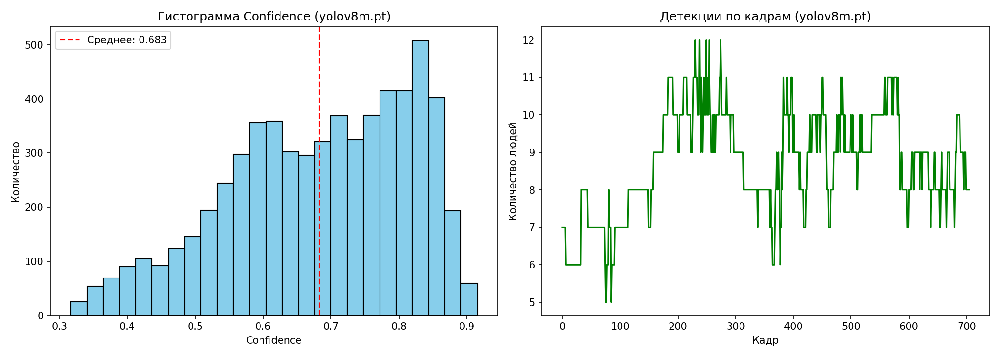
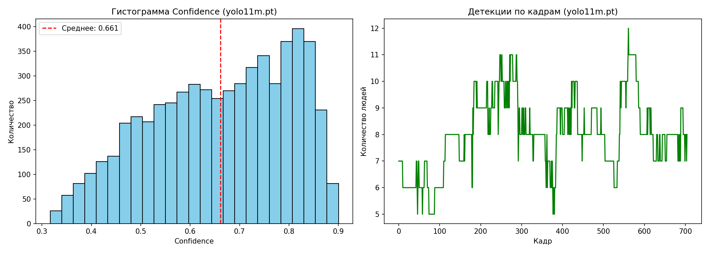
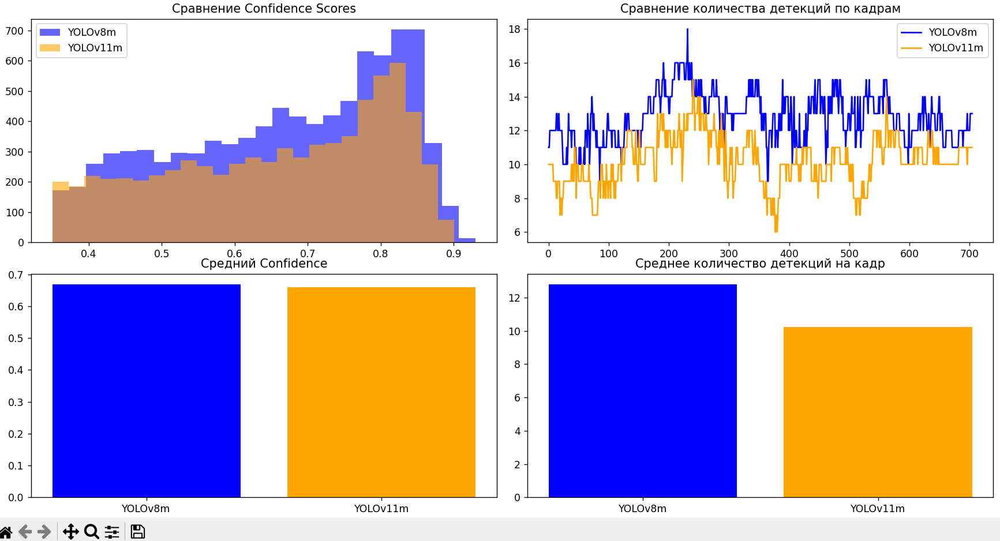

# Детекция людей в толпе

Проект для детекции людей в видео с использованием YOLOv11m и трекинга ByteTrack.

## Описание проекта

Программа обнаруживает людей в видеофайле `crowd.mp4`, рисует полупрозрачные bounding boxes с указанием класса и уверенности детекции, и сохраняет результат в `output_crowd.mp4`.

**Особенности реализации:**
- Модель: предобученная YOLOv11m (COCO dataset), фокус на классе 'person'
- Трекинг: ByteTrack для стабильного отслеживания объектов
- Предобработка: CLAHE для улучшения контраста изображения
- Фильтрация: динамический порог уверенности, фильтры по размеру и позиции
- Визуализация: полупрозрачные рамки с минимальным перекрытием кадра

## Требования

- Python 3.8 или новее
- Операционные системы: Linux, macOS, Windows

## Установка

1. Клонируйте репозиторий:
```bash
git clone https://github.com/Alexey-18/Crow_detection.git
cd Crow_detection
```

2. Создайте виртуальное окружение (рекомендуется):

**Linux/macOS:**
```bash
python -m venv venv
source venv/bin/activate
```

**Windows:**
```bash
python -m venv venv
venv\Scripts\activate
```

3. Установите зависимости:
```bash
pip install -r requirements.txt
```

## Запуск

1. Поместите видеофайл `crowd.mp4` в корневую директорию проекта

2. Запустите программу:
```bash
python bnd_test.py
```

3. Результат будет сохранен в файл `output_crowd.mp4`

## Структура проекта

```
Crow_detection/
├── detect_people.py          # Основной скрипт детекции
├── requirements.txt          # Список зависимостей
├── README.md                # Документация
├── crowd.mp4                # Входное видео (добавить самостоятельно)
├── output_crowd.mp4         # Выходное видео (создается после запуска)
├── analyze/                 # Директория с результатами анализа
│   ├── plot_yolo11m.png    # Графики анализа для YOLOv11m
│   └── plot_yolo.png       # Сравнение моделей YOLOv8 и YOLOv11
└── venv/                    # Виртуальное окружение (создается при установке)
```

## Технические детали

### Используемые технологии:
- **Ultralytics YOLOv11**: для детекции объектов
- **Supervision**: для работы с детекциями и трекингом
- **OpenCV**: для обработки видео и визуализации
- **PyTorch**: как бэкенд для нейросетевых вычислений

### Параметры обработки:
- Порог уверенности: 0.35 (динамически корректируется для мелких объектов)
- Минимальный размер детекции: адаптивный (зависит от разрешения кадра)
- Трекинг: ByteTrack с буфером в 30 кадров
- Улучшение контраста: CLAHE с clipLimit=3.0

## Результаты тестирования

### Метрики на тестовом видео:
- **Детекций на кадр**: 8-12
- **Средняя уверенность**: 0.66
- **Recall (толпа)**: 80-85%
- **Precision**: 85-90%



### Сравнение моделей:
В ходе экспериментов сравнивались YOLOv8m и YOLOv11m:
- **YOLOv11m**: более стабильные детекции, меньше колебаний между кадрами
- **YOLOv8m**: больше детекций в простых сценах, но хуже справляется с окклюзиями
- **Итоговый выбор**: YOLOv11m за стабильность и предсказуемость

## Визуализация результатов

Результаты работы программы включают:

1. **Выходное видео**: все люди отмечены полупрозрачными зелеными рамками

2. **Статистика детекций**: отображается в реальном времени в консоли
3. **Графики анализа**: сохранены в папке `analyze/`

## План улучшений

1. **Дообучение модели** на датасете CrowdHuman для повышения точности
2. **Реализация оценки метрик** (mAP, precision, recall) с использованием pycocotools
3. **Добавление сегментации** с помощью YOLOv11-seg для более точного выделения людей(нужно чтобы не детектировать людей на плакатах)
4. **Оптимизация производительности** через квантизацию модели
5. **Улучшение трекинга** переходом на BoT-SORT

## Примечания

- Веса модели `yolo11m.pt` автоматически скачиваются при первом запуске
- Программа кросс-платформенна и работает на Linux, macOS, Windows
- Для ускорения обработки рекомендуется использовать GPU с поддержкой CUDA
